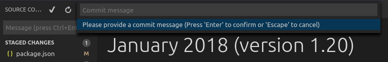

# commitmsgfmt

`commitmsgfmt` formats commit messages. It reflows and wraps text, with special
understanding of patterns often seen in commit messages.

For formatting commit messages, `commitmsgfmt`'s support for non-trivial text
constructs makes it superior to `fmt(1)`; its simplicity makes it superior to
Vim's internal formatting function; and its ease of use makes it superior to
`par(1)`.

`commitmsgfmt` is written specifically for use with Vim's `'formatprg'` option,
which passes text to format on standard input and reads the formatted result on
standard output. If your text editor does not have a similar integration
mechanism `commitmsgfmt` can also be used in a Git hook.

* [Formatting overview](#formatting-overview)
    * [Limitations](#limitations)
* [Installation](#installation)
    * [Vim](#vim)
    * [Editor without 'formatprg'-like](#editor-without-formatprg-like)
* [Motivation](#motivation)
    * [Other version control systems](#other-version-control-systems)
    * [Alternatives](#alternatives)

## Formatting overview

In summary, `commitmsgfmt`

- ensures a single-line subject of up to 90 characters, separated from the body
  by a single blank line, by pushing any extra characters into a body
  paragraph;

- reflows and wraps all other prose at the specified max width, defaulting to
  72 characters based on Time Pope's recommendation from 2008 [[tpope]];

- properly indents continuation lines in numbered and unnumbered lists,
  recognizing several different list styles;

- exempts comments; text indented at least 4 spaces or 1 tab; "trailers"
  (`Signed-off-by:`); and IEEE-style references from reformatting;

- assumes UTF-8 encoded input but can gracefully degrade to ISO-8859-1
  ("latin1") which has been observed in the Linux kernel;

- counts "characters" as they appear on screen, i.e. graphemes, without
  mangling multi-byte characters.

### Limitations

- `commitmsgfmt` is context sensitive but Vim's `gq` command has no context,
  rendering the general form of it effectively useless. One or more mappings
  can alleviate this but it has implications for muscle memory.

- `commitmsgfmt` was not written to handle certain constructs that appear in
  merge commit messages in the Git and Linux kernel projects. If you write
  merge commit messages any differently from non-merge commit messages you may
  want to disable `commitmsgfmt` when merging, as demonstrated in the
  installation instructions.

- `commitmsgfmt` currently uses a greedy algorithm to wrap text, like `fmt` and
  unlike `par`, because the implementation is easy to write and the result easy
  to compare against authentic commit messages. Unfortunately this produces
  flush-left/ragged-right text that tends to look worse than justified text.
  This behaviour is considered a halfway happy, not a specification, and may or
  may not change.

## Installation

`commitmsgfmt` is written in Rust and does not yet provide pre-built binaries.
Run `cargo build --release` to build the binary, then place
`target/release/commitmsgfmt` somewhere in your `$PATH`.

### Vim

To integrate with Vim ensure you have `filetype plugin on`, then create the
file `$HOME/.vim/after/ftplugin/gitcommit.vim` containing, at least,

```vim
setlocal formatprg=commitmsgfmt
```

The above setting is the absolute minimum requirement, and is *sufficient*, but
can be improved upon in a few ways. See the sample
`contrib/vim/after/ftplugin/gitcommit.vim` file for details.

### Editor without 'formatprg'-like

> This is basically all text editors I know of, however, I expect Emacs can be
> made to work like Vim. I would gladly include such a contributed example
> configuration.

For text editors without the ability to delegate reformatting to a third-party
tool you can leverage the `commit-msg` Git hook [[hooks]] to reformat the
commit message. This works, and is explicitly allowed by the specification, but
you lose the ability to easily undo any undesirable formatting caused by
`commitmsgfmt`.

> If `commitmsgfmt` makes a mistake you *have* to correct, run
> `git commit --amend --no-verify` to reopen the last commit's message for
> editing and bypass the hook.

`contrib/git/hooks/commit-msg` defines a complete `commit-msg` hook ready for
use; just copy it to your repository's hook directory:

```sh
$ cp contrib/git/hooks/commit-msg ~/foo/bar-repo/.git/hooks/
```

The provided hook is conservative to make up for the difficulty of correcting
mistakes. If you know you never write merge commit messages any differently
from non-merge commit messages feel free to enable `commitmsgfmt` for merge
commits, too.

If you don't want to repeat this setup for every single repository, consider
specifying either the `init.templateDir` Git configuration option to always
include this hook for new repositories [[templatedir]] or the `core.hooksPath`
option to centralise Git hooks [[hookspath]].

## Motivation

My reasons for writing `commitmsgfmt` are numerous and varied, and include such
things as boredom, a desire to play with Rust, and a capacity for obsessing
over the immaterial. More than anything, though, I had grown weary of tuning
Vim's various formatting related options and never being quite satisfied.

Additionally, the quality of commit integrations in many popular editors and
IDEs is simply appalling and that is an obstacle to good version control
hygiene. Instead of bemoaning the influx of fashionably inadequate Git
integrations I wrote a tool to sidestep one of their limitations. If this
sounds judgmental consider this picture of one enormously popular text editor's
Git commit integration:



### Other version control systems

`commitmsgfmt` uses Git-like conventions because I use Git but is ultimately
agnostic about version control systems. I welcome contributions on integrating
with other systems.

### Alternatives

`commitmsgfmt` is a third-party dependency, written in a tool chain less
ubiquitous than C and C++, that solves a trivial, ultimately inconsequential
problem. Other tools more readily available solve a related problem of general
text formatting and their limitations may be a preferable trade-off.

- `fmt(1)` offers limited reflowing and wrapping functionality with some
  configurability, sufficient for simple prose. It does not handle lists.

- Vim has configurable built-in text formatting and, when configured correctly,
  tends to do a better job than `fmt`. Its main limitations are configuration
  complexity and an inability to exempt certain text constructs from formatting
  rules.

- `par(1)` [[par]] is "vaguely similar to `fmt`, but better." It is highly
  configurable and excellent at justifying text, generally yielding prettier
  results than `fmt`. It is also very difficult to configure.

[git-repo]: https://git.kernel.org/pub/scm/git/git.git/ "Git repository"
[hooks]: https://git-scm.com/docs/githooks "Git hooks documentation"
[hookspath]: https://git-scm.com/docs/git-config#git-config-corehooksPath "Git configuration documentation"
[linux-repo]: https://git.kernel.org/pub/scm/linux/kernel/git/torvalds/linux.git/ "Linux kernel repository"
[par]: http://www.nicemice.net/par/ "Par paragraph formatter"
[templatedir]: https://git-scm.com/docs/git-config#git-config-inittemplateDir "Git configuration documentation"
[tpope]: http://tbaggery.com/2008/04/19/a-note-about-git-commit-messages.html "A Note About Git Commit Messages"
